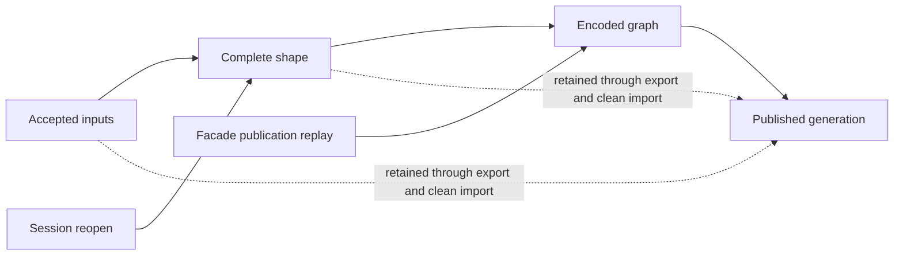
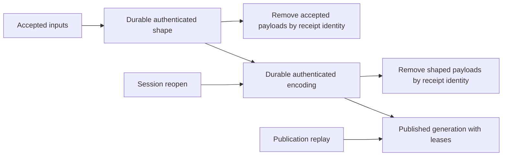

# Construction supersession review

Issue #1195; source baseline `345b0108` (full source identity and measured
fixtures accompany the implementation evidence). Correctness and recovery take
precedence over allocation savings.

## Existing guarantees and consumers

| Representation | Authority and consumer | Required lifetime |
| --- | --- | --- |
| Accepted Parquet, UUID, detail and endpoint runs | Ordered chunk receipts ending at the checkpoint digest; seal and shape validate and consume them | Until complete shape and its checkpoint binding are durable |
| Intermediate sorted runs | Session directory identity, writer receipts, allocation identities; later merge levels | Until their merge consumer completes; existing merge cleanup handles this |
| Completed shape and remaining merged runs | Complete shape inventory binds output identities/digests; encoder consumes them | Until checkpoint-bound encoding has authenticated successor payloads |
| Encoded graph and indexes | Encoding inventory digest in checkpoint; CAS publication consumes them | Through publication and compatible encoding replay |
| Published graph and retained parent | Immutable generation, manifest, CAS and generation leases; ordinary queries, streams and portable export | Governed by generation retention; never construction cleanup candidates |
| Chunk, shape, encoding and publication controls | Session/project identity, pinned parent, digest chain and transaction | Retain for idempotency, replay, ownership and accounting reconciliation |

Before:



The retained-input requirement is an implementation dependency, not an
additional user-visible data version. Published generation readers and active
streams do not consume private accepted or shaped files. Existing versions
6–8 nevertheless promise these replay dependencies and must continue unchanged.

## Decision

Use existing complete shape, checkpoint-bound encoding and publication
authority as supersession boundaries in a new construction checkpoint version.
Keep the existing staging/sealed/publishing/published states. Two monotonic
completion bits in the existing checkpoint distinguish completed input and
shape removal. These are necessary because filesystems reuse inode identities:
an old missing predecessor receipt must not debit a new encoded file that
later reuses its inode. No new payload writer runs until the preceding removal
completion checkpoint is durable. Retain receipts;
do not introduce another publication journal or user-visible cleanup operation.

After:



Alternatives considered: publication-only cleanup lowers late retained storage
but leaves the earlier encoding peak unchanged; a separate retirement journal
duplicates eligibility already established by durable successor bindings. The
selected approach removes two predecessor dependencies without adding another
state machine. It does add a format-version distinction so older readers fail
closed instead of interpreting missing inputs using the former contract.

The publication receipt alone is insufficient successor authentication.
Version nine therefore authenticates the immutable public inventory and every
CAS payload, holding generation/object leases through validation. An encoding successor must match the checkpoint digest
and authenticate its files, including required parent references.

Missing eligible predecessor files can be reconciled only after successor
authentication. Replacement identities, unexpected links, corrupt successors
and failed synchronization remain errors. Allocation transitions record
confirmed removal; historical maxima are never reduced. Crash/error coverage
must include unlink-before-sync and sync-before-checkpoint, repeated resume,
legacy continuation and replay after CURRENT advances.

## Measurement and completion gates

The deterministic `construction_lifecycle_multilevel_allocation_baseline`
fixture uses 8,192 nodes and 32,768/65,536/131,072 edges, 4,096-row chunks and
fan-in two. It measures accepted, shaped, encoded and published boundaries
using physical file identities to count aliases once. Columns for each owner
are logical bytes, allocated bytes and unique physical objects. Its phase
census is retained storage at that boundary; historical simultaneous peaks
come from the existing allocation transitions, never a sum of owner peaks.

The count of public lifecycle states is unchanged; the private format adds two
monotonic completion facts and no journal. There are still three transient
payload representations during construction, but only encoding remains after
its successor boundary (instead of accepted inputs, shape and encoding).
`ConstructionShape` names are receipt references after encoding; replay through
the session remains supported, while callers must not open retired private
paths. Cancellation is polled per bounded payload read and between removals;
a cancellation after partial removal resumes using the same durable receipts.
After `CURRENT` commits, final receipt recording completes without cancellation.

The small-fixture report does not establish S22 or S26 savings. #901/#900/#745
retain the named-host ladder, available-capacity and 15% reserve gates. Public
facade tests must also prove values, schema, external UUIDs, reopen, query,
export, verification and clean-import equivalence.

## Paired deterministic measurements

Measured on native Linux x86_64 with Rust 1.96.0
(`ac68faa20`, 2026-05-25), based on source
`345b01085d8566a492b9364eedbf0bb68d0a5a2c` plus this issue's focused diff.
The regression runs versions 8 and 9 in the **same binary**, using identical
UUIDs, Arrow batches, fan-in and row bounds. The PR records the tested head.
Graph format and permanent payload encoding are unchanged. UUIDs are sequential
synthetic values; this is a lifecycle comparison, not a compression benchmark.

Reproduce on an admitted native filesystem (including `TMPDIR`):

```bash
CARGO_TARGET_DIR=/path/to/isolated-target TMPDIR=/path/to/native-tmp \
  cargo test -p graphforge-storage --lib graph_construction -- --nocapture
CARGO_TARGET_DIR=/path/to/isolated-target TMPDIR=/path/to/native-tmp \
  cargo test -p graphforge-api --lib resumable_construction
CARGO_TARGET_DIR=/path/to/isolated-target TMPDIR=/path/to/native-tmp \
  cargo test -p graphforge-api --test scale_g500_ladder
```

All quantities below are raw allocated bytes from the construction payload
ledger. They exclude receipt/control files, reported independently by the
physical census. The peak is the historical simultaneous payload union.

| Edges | v8 retained | v9 retained | v8 peak | v9 peak | Added authenticated read bytes |
| ---: | ---: | ---: | ---: | ---: | ---: |
| 32,768 | 23,425,024 | 4,644,864 | 23,425,024 | 20,873,216 | 41,813,311 |
| 65,536 | 44,494,848 | 8,249,344 | 44,494,848 | 40,435,712 | 79,132,926 |
| 131,072 | 86,634,496 | 15,458,304 | 86,634,496 | 79,560,704 | 153,770,992 |

Retained payload decreases about 80–82%; the earlier peak decreases only about
8–11%. The latter remains a real limitation. Authentication uses fixed 1-MiB
reads for private retirement payloads and 64-KiB reads for CAS successors;
the encoding authenticator retains its existing fixed buffer. The fixture enforces recovery/supersession reads
below eight accepted-input payload writes plus 16 MiB, zero retained merge
bytes, and at least a halving of retained payload. Existing public full-lifecycle
checks retain RSS, buffered-call, phase, physical-identity and peak budgets.

Version nine leaves no accepted or shaped payload objects at publication.
For each phase, `LIFECYCLE_BASELINE` emits logical bytes, allocated bytes and
physical objects for accepted inputs, shape/merge, encoding and controls;
physical identity deduplication prevents counting hard-link aliases twice.
The encoding census includes its JSON controls, unlike the payload ledger.
The permanent public project, export and import are separate owners in the
existing full-lifecycle ladder and are not included in the table above.
