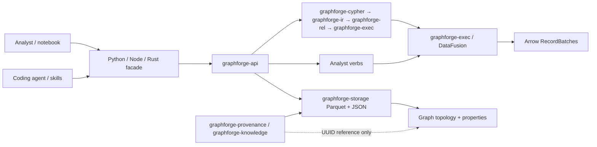

# Architecture

GraphForge is a Rust-core embedded workbench: Cypher and analyst verbs converge on
DataFusion execution and Arrow results, with Parquet/JSON project storage and thin
language bindings. Detail and status banners live in
[`../book/architecture/overview.md`](../book/architecture/overview.md); this document is the
public contributor lifecycle summary.

## Context diagram

## Components

| Component | Responsibility | Depends on |
| --------- | -------------- | ---------- |
| `graphforge-api` | Public facade: lifecycle, Cypher, analyst verbs | `graphforge-cypher`, `graphforge-exec`, `graphforge-storage`, knowledge crates |
| `graphforge-cypher` / `graphforge-ast` | Parse Cypher to AST | — |
| `graphforge-ir` / `graphforge-rel` | Graph IR and relational lowering | AST / ontology |
| `graphforge-exec` / `graphforge-plan` | DataFusion execution, algorithms, search | IR, storage providers |
| `graphforge-storage` | Generations, participants, Parquet I/O | filesystem |
| `graphforge-ontology` | Progressive ontology validation | API / binder |
| `graphforge-provenance` / `graphforge-knowledge` | Provenance and epistemic records | UUID references to graph |
| Bindings | Thin FFI projections | `graphforge-api` / core facade |

## Data model

- **Project** — unit of work: graph + knowledge + workbench assets + sync state.
- **Node / edge** — graph-native entities with properties; surrogate keys in execution;
  UUID identity at the API boundary.
- **Ontology** — optional progressive model (`exploratory` / `advisory` / `strict`).
- **Knowledge records** — provenance, confidence, epistemic assertions attached by UUID,
  never as graph-table columns that alter Cypher results.
- **Results** — Arrow tables/batches as the cross-language contract.
- **On disk** — Parquet for graph data; JSON for metadata and contracts.

Schemas and frozen inventories also live under [`../contracts/`](https://github.com/CurateLabs/graphforge/tree/main/docs/contracts) and
architecture deep-dives in [`../book/architecture/`](../book/architecture/overview.md).

## Problem model and terminology

| Concept | Meaning in this project | Relationships, states, rules, and owner |
| --- | --- | --- |
| Project | Portable analysis workspace | Contains graph + knowledge + workbench assets; `graphforge-api` / storage |
| Graph layer | Topology, properties, traversal, algorithms | Never stores knowledge semantics; Cypher reads only this layer |
| Knowledge layer | Provenance, evidence, epistemic status | Attaches by UUID; append-only interpretation (ADR 0006) |
| Workbench layer | Analyst verbs, search, workflows, recipes | Consumes lower layers; holds no graph-semantic state |
| Progressive ontology | Exploration-first typing | Modes exploratory → advisory → strict; ADR 0003 |
| Catalog ID vs ontology ID | Distinct ID spaces | Never substitute one for the other |
| Analyst verb | Intent API bypassing Cypher | rank/cluster/paths/analyze/similar/find → Arrow |

## Key flows

### Cypher query

1. Binding or Rust caller invokes `execute` on `graphforge-api`.
2. `graphforge-cypher` parses; binder applies ontology rules for the active mode.
3. Plan lowers through Graph IR → relational plan → DataFusion.
4. `graphforge-exec` streams Arrow batches back through the facade.

### Analyst verb

1. Caller invokes a verb on `graphforge-api` (no Cypher string).
2. Facade exports adjacency/index views and dispatches algorithm or search.
3. Execution produces scored Arrow batches via the same result contract.

### Project reopen

1. Caller opens a project path.
2. `graphforge-storage` loads Parquet/JSON generations.
3. Subsequent Cypher/verbs observe the last published generation (recovery rules in
   storage/checkpoint docs and ADRs).

## Cross-cutting concerns

- **Error handling:** structured GraphForge error codes; fail closed on unsupported
  containers, capability gaps, and writer-busy.
- **Configuration:** zero-config in-memory default; path argument selects durable project.
- **Security / tenancy:** single-user embedded default; not a multi-tenant server.
- **Observability:** local diagnostics + CI contract gates; see
  [`OBSERVABILITY.md`](OBSERVABILITY.md).
- **Correctness bar:** TCK + non-Cypher surface inventories; wrapper/logical-plan tests
  alone are insufficient (`AGENTS.md`).
- **Build system:** Bazel (Bazelisk) owns CI Rust compilation and the mapped test
  graph; Cargo manifests remain ecosystem inputs. See
  [`../development/bazel.md`](../development/bazel.md). Publish credentials stay
  outside cacheable Bazel actions. Swift/Kotlin UniFFI bindings are not an M2
  build-migration deliverable.

## Decisions

ADR bodies live in [`../adr/`](../adr/) as the contiguous v0.5.0 sequence `0001`–`0014`.
The DocSlime index is [`adrs/README.md`](adrs/README.md) (links only; does not renumber bodies).

| ADR | Decision |
| --- | --- |
| [0001](../adr/0001-rust-core.md) | Rust core owns semantics |
| [0002](../adr/0002-lr1-grammar.md) | Recursive descent + Pratt parser for `graphforge-cypher` |
| [0003](../adr/0003-progressive-ontology.md) | Progressive ontology — exploration first |
| [0004](../adr/0004-adjacency-index.md) | Graph-native adjacency index |
| [0005](../adr/0005-layered-architecture.md) | Graph / knowledge / workbench layers |
| [0006](../adr/0006-epistemic-model.md) | Append-only epistemic interpretation |
| [0007](../adr/0007-temporal-values.md) | Runtime temporal values |
| [0008](../adr/0008-heterogeneous-lists.md) | Heterogeneous list values |
| [0009](../adr/0009-nested-heterogeneous-lists.md) | Nested heterogeneous lists |
| [0010](../adr/0010-wide-date-and-duration.md) | Wide date and duration |
| [0011](../adr/0011-dynamic-heterogeneous-values.md) | Dynamic heterogeneous value lists |
| [0012](../adr/0012-m20-domain-ownership.md) | Knowledge and epistemic domain ownership and schema evolution |
| [0013](../adr/0013-project-generation-protocol.md) | Durable project-generation protocol |
| [0014](../adr/0014-workspace-checkpoints.md) | Complete-workspace checkpoints |
| [0015](../adr/0015-embedded-write-modes.md) | Three embedded project-write modes |
| [0016](../adr/0016-repository-integration-and-deployment-configuration.md) | Repository integration and deployment configuration boundary |
| [0017](../adr/0017-unified-release-version.md) | One version across core and adapters |

## Risks & trade-offs

- **Research/notebook scale** — not positioned for multi-tenant billion-edge serving;
  limits documented in [`../reference/scale-limits.md`](../reference/scale-limits.md).
- **Pre-v1 format churn** — no compatibility promise for historical containers; operators
  must use current-generation projects.
- **Docs layers** — DocSlime lifecycle + Guide + Book; Starlight (`docs-site/`) syncs an
  allowlist and must not fork a second product narrative (#2731 polish may still refine nav).
- **ADR body home** — physical ADR directory is `docs/adr/`; do not fork a second sequence
  under `engineering/adrs/`.
