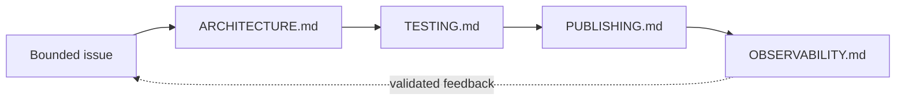

# Engineering

Engineering follows public behavior through design, pre-release evidence, continuous
delivery, and production learning.



## Lifecycle

| Document | Responsibility |
| --- | --- |
| [`ARCHITECTURE.md`](ARCHITECTURE.md) | Problem model, responsibility boundaries, and components that satisfy requirements |
| [`TESTING.md`](TESTING.md) | How tests and CI prove the system before release |
| [`PUBLISHING.md`](PUBLISHING.md) | How verified artifacts are versioned, promoted, and rolled back |
| [`OBSERVABILITY.md`](OBSERVABILITY.md) | How CI/release/user signals feed discovery |
| [`adrs/`](adrs/) | ADR index (bodies in [`../adr/`](../adr/) `0001`–`0014`) |

## Supporting documentation

| Document | Description |
| --- | --- |
| [`../book/architecture/`](../book/architecture/overview.md) | Deep architecture notes, pipeline, storage, embedding contracts |
| [`../development/`](../development/contributing.md) | Contributor workflow, testing detail, release process |
| [`../development/bazel-migration-orchestration.md`](../development/bazel-migration-orchestration.md) | M2 / #1 Bazel migration sub-agent roles, contracts, and handoffs |
| [`../contracts/`](https://github.com/CurateLabs/graphforge/tree/main/docs/contracts) | Frozen public API / fingerprint JSON contracts |
| [`../reference/`](../reference/api.md) | Compatibility, TCK, scale limits, column naming |
| Root `AGENTS.md` | Agent workflow and validation gates |

## Decision records

Create the next Architecture Decision Record with:

```sh
docslime add adr <short-slug>
```

Until bodies live under `engineering/adrs/`, add new ADR markdown under `docs/adr/` and update
both [`../adr/README.md`](../adr/README.md) and [`adrs/README.md`](adrs/README.md) in the same
change. Do not fork a second numbering sequence.
